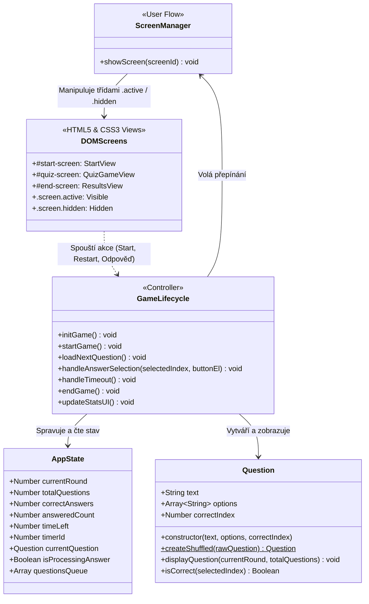

# 🧠 QuizApp v3: Víceobrazovková Architektura a Redesign

Výuková interaktivní webová kvízová aplikace zaměřená na víceobrazovkovou architekturu (Multi-screen Architecture), řízení uživatelského průchodu (User Flow), manipulaci se stavovými třídami přes `classList`, centralizovaný design systém pomocí CSS proměnných (`:root` Custom Properties) a kompletní správu životního cyklu hry (`initGame`, `startGame`, `endGame`).

Tato fáze představuje **3. fázi (víceobrazovkovou architekturu a redesign)**, která transformuje jednonástěnkovou aplikaci na plnohodnotný produkt se třemi dedikovanými obrazovkami (Úvodní obrazovka, Kvízové rozhraní a Závěrečná výsledková rekapitulace).

---

## 🎯 Klíčová témata a výukové cíle

* **Architektura více obrazovek (Multi-Screen Architecture & User Flow)**:
  * Rozdělení aplikace do samostatných sémantických sekcí `<section id="..." class="screen">`.
  * Řízení viditelnosti přepínáním tříd `.active` a `.hidden` (`display: none !important`).
  * Tvorba modulární helper funkce `showScreen(screenId)`.
* **Řízení životního cyklu hry (Game Lifecycle Management)**:
  * Inicializace stavu aplikace při spuštění (`initGame()`).
  * Start herní relace s výběrem náhodné podmnožiny otázek a resetem počitadel (`startGame()`).
  * Závěrečné vyhodnocení, výpočet finálních statistik a zobrazení rekapitulace (`endGame()`).
* **Design systémy a CSS proměnné (CSS Custom Properties)**:
  * Centralizace barevné palety, typografie a rozměrů v kořenovém selektoru `:root`.
  * Rychlá možnost redesignu a přestylování aplikace bez zásahu do funkční logiky (převod tokenů z Figmy).
* **Dynamické vyhodnocení výsledků**:
  * Výpočet procentuální úspěšnosti pomocí `Math.round()`.
  * Kontextové motivační zprávy na základě dosaženého skóre.

---

## 📐 Architektura Aplikace (UML Diagram)



---

## 🧩 Struktura Projektu

```text
quiz-app-v3-multiscreen/
├── index.html            # Vstupní stránka se 3 sekcemi obrazovek (#start-screen, #quiz-screen, #end-screen)
├── styles.css            # Referenční styly s CSS proměnnými (:root), pravidly viditelnosti a kartami
├── styles-students.css   # Pracovní studentská verze stylů s TODO úkoly pro proměnné a obrazovky
├── script.js             # Referenční JS logika s přepínáním obrazovek a správou životního cyklu
├── script-students.js    # Pracovní studentská verze JS s nápovědou pro showScreen(), startGame() a endGame()
├── LICENSE               # Plný text licence GNU AGPL-3.0
├── README.md             # Tento didaktický průvodce s architekturou a návodem
└── docs/                 # Výukové podklady a taháky
    ├── quiz-app-v3-multiscreen.md
    └── JS_user_flow_CSS_promenne_tahak.md
```

---

## 🚀 Jak s projektem pracovat

### 1. Spuštění referenční aplikace
1. Otevřete soubor [`index.html`](index.html) v libovolném moderním webovém prohlížeči (např. přes rozšíření *Live Server* ve VS Code).
2. Na úvodní obrazovce si prohlédněte pravidla a klikněte na tlačítko **Spustit kvíz 🚀**.
3. V herním rozhraní zodpovězte 5 otázek v limitu 10 sekund na otázku.
4. Po zodpovězení 5. otázky se aplikace automaticky přepne na závěrečnou obrazovku s vyhodnocením a celkovou úspěšností.
5. Kliknutím na **Hrát znovu 🔄** restartujte kvíz s nově namíchanými otázkami.

### 2. Přepnutí na studentskou pracovní verzi
V souboru [`index.html`](index.html) přepněte komentáře odkazů:

* **Pro styly** v sekci `<head>`:
  ```html
  <!-- <link rel="stylesheet" href="styles.css"> -->
  <link rel="stylesheet" href="styles-students.css">
  ```
* **Pro skript** před koncem `</body>`:
  ```html
  <!-- <script src="script.js"></script> -->
  <script src="script-students.js"></script>
  ```
* Postupujte podle číslovaných úkolů `TODO 1` až `TODO 3` v souboru [`styles-students.css`](styles-students.css) a `TODO 1` až `TODO 5` v souboru [`script-students.js`](script-students.js).

---

## 🎯 Co se student naučí

1. **Strukturovat víceobrazovkové webové aplikace**: Naučí se rozdělovat HTML do logických stavových kontejnerů a pracovat s čistým oddělením jednotlivých částí uživatelského průchodu.
2. **Implementovat přepínání obrazovek (User Flow)**: Ovládne manipulaci s CSS třídami (`.hidden`, `.active`) přes `document.querySelectorAll()` a `classList`, aniž by musel přepisovat inline styly.
3. **Řídit životní cyklus aplikace**: Pochopí stavový automat jednoduché hry – od úvodního nastavení (`initGame`), přes herní smyčku (`startGame`, `loadNextQuestion`), až po ukončení a finální vyhodnocení (`endGame`).
4. **Využívat CSS proměnné (Design Tokens)**: Naučí se definovat centrální téma v `:root` a aplikovat jej napříč komponentami, což umožňuje bleskový redesign aplikace dle grafických návrhů z Figmy.
5. **Generovat personalizovanou zpětnou vazbu**: Zvládne dynamicky kalkulovat procentuální úspěšnost hráče a zobrazovat motivační texty a ikony.

---

## ⚙️ Použité technologie & Požadavky

* **HTML5**: Sémantické sekce (`<section>`, `<article>`, `<header>`, `<main>`, `<footer>`), ARIA atributy pro přístupnost.
* **CSS3**: CSS Custom Properties (`var(--...)`), Flexbox / Grid rozvržení, přechodové animace (`transition`, `@keyframes fadeIn`), stavové třídy.
* **JavaScript**: ECMAScript 2020+ (Třídy, Arrow functions, Destructuring, Spread syntax, manipulace s DOM `classList`, asynchronní časovače).
* **Podporované prohlížeče**: Libovolný moderní prohlížeč (Google Chrome, Mozilla Firefox, Microsoft Edge, Safari) bez nutnosti instalace dalších balíčků.

---

## 👤 Autor a Licencování

**Autor:** Jakub Březa (Vlk samotář) – [VlkSamotar.cz](https://vlksamotar.cz) | Informatika | Trading | Elektrotechnika 

---

## 📜 Licence & Komerční využití

Tento projekt je šířen pod licencí **GNU Affero General Public License v3 (AGPL-3.0)** (viz přiložený soubor [LICENSE](LICENSE)).

### Co to znamená?
* **Pro studenty a samouky:** Projekt můžete volně používat, studovat a upravovat pro své osobní účely.
* **Pro lektory a vzdělávací organizace:** Můžete projekt využít při výuce, ale **pokud aplikaci (nebo její upravenou verzi) provozujete na síti/webu, musíte zachovat zdrojový kód otevřený pod stejnou licencí AGPL-3.0** a uvést původního autora.

### 💼 Máte zájem o komerční využití bez omezení AGPL?
Pokud chcete tento interaktivní playground integrovat do své komerční (uzavřené) platformy, e-learningu nebo máte zájem o white-label řešení pro vaši školu, kontaktujte mě na [VlkSamotar.cz](https://vlksamotar.cz) pro sjednání **komerční proprietární licence**.

---

## 🧩 Třetí strany a závislosti

* **Google Fonts (Lexend, Roboto)**: Šířeno pod otevřenou licencí [SIL Open Font License 1.1](https://openfontlicense.org/).
* Projekt je čistě nativní a nevyžaduje žádné npm balíčky, runtime frameworky ani bundlery.
